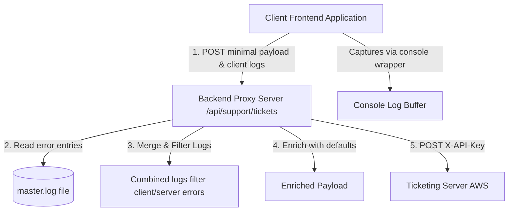

# External Ticket Integration Guide

This guide describes how to integrate the Support / Feedback button in other applications (such as Yoda `myyodaai.mygoapps.com`, DocSync `mydocsyncai.mygoapps.com`, Resume `resume.mygo-ops.com`, etc.) to automatically submit support tickets to the **Mygo Tickets** platform.

---

## Architecture Overview

There are two patterns for integrating with the Mygo Tickets platform:
1. **Direct Integration (Frontend-Only)**: The client application communicates directly with the AWS Ticketing server. *Not recommended for production* as it exposes the API Key on the client side.
2. **Backend Proxy Integration (Recommended)**: The client-side application calls its own backend, which enriches the payload (with server-side logs and default routing values) and securely proxies the request to the Ticketing server using server-side environment variables.



---

## 1. Direct Integration (Simple / Frontend-Only)

For development or internal applications, the client side can send HTTP requests directly to the Ticketing Server.

### Authentication
Add the `X-API-Key` header to your HTTP requests:
```http
X-API-Key: <your-external-support-api-key>
```
> [!NOTE]
> The default API key in development is `mygo-external-support-key`. Configure this in production via the `EXTERNAL_API_KEY` environment variable.

### API Endpoint Details
* **URL**: `http://ec2-54-221-31-53.compute-1.amazonaws.com/api/tickets`
* **Method**: `POST`
* **Content-Type**: `application/json`

### Complete Request Payload Schema
| Field | Type | Required | Description |
| :--- | :--- | :--- | :--- |
| `title` | `string` | **Yes** | A brief summary of the issue. |
| `category` | `string` | **Yes** | The core category (e.g. `IT Operations`, `Access Management`, `HR & Payroll`). |
| `subcategory` | `string` | **Yes** | The subcategory under the chosen category (e.g. `Software Issues`). |
| `priority` | `string` | **Yes** | The severity: `Low`, `Medium`, `High`, or `Critical`. |
| `description` | `string` | No | Detailed description of the error or user request. |
| `tenantId` | `string` | No | The unique identifier of the tenant/organization raising the issue. |
| `source` | `string` | No | The domain or app name from which the issue originates (e.g., `myyodaai.mygoapps.com`). |
| `logs` | `string[]` or `string` | No | Log lines detailing the environment state or exceptions. **Only saved if the category is "IT Operations".** |
| `requestorEmail` | `string` | **Yes** | The email address of the user raising the ticket. |
| `requestorName` | `string` | No | The name of the user (Defaults to email prefix if not supplied). |

---

## 2. Production Pattern: Backend Proxy Integration (Recommended)

In production, you should route tickets through a local backend proxy route (e.g., `/api/support/tickets`). This achieves:
* **API Key Protection**: The API Key is kept secret on the server.
* **Default Values Centralization**: Frontend UI is simplified; it doesn't need to specify ticketing categories, subcategories, or sources.
* **Log Separation & Aggregation**: Allows combining client-side console logs with backend server error logs.

### Backend Proxy Implementation (Express.js Example)

Add this endpoint to your backend application:

```javascript
const fs = require('fs');
const path = require('path');
const fetch = require('node-fetch'); // Or use global fetch in Node 18+

app.post('/api/support/tickets', async (req, res) => {
    try {
        const { title, description, priority, logs: clientLogs, requestorEmail, requestorName, tenantId } = req.body;
        
        // 1. Retrieve server-side error logs (last 5 lines containing ' - ERROR - ')
        const logPath = path.join(__dirname, 'master.log');
        let serverLogs = [];
        try {
            if (fs.existsSync(logPath)) {
                const logText = fs.readFileSync(logPath, 'utf8');
                const lines = logText.split('\n');
                // Filter only lines containing " - ERROR - "
                const errorLines = lines.filter(line => line.includes(' - ERROR - '));
                serverLogs = errorLines.slice(-5);
            }
        } catch (logErr) {
            console.error("⚠️ Failed to read master.log for support ticket:", logErr.message);
        }

        // 2. Filter & Combine client and server logs
        const combinedLogs = [];
        if (clientLogs && Array.isArray(clientLogs)) {
            // Filter client logs to only include lines indicating actual Errors
            const clientErrors = clientLogs.filter(l => l.includes('[ERROR]') || l.toLowerCase().includes('error'));
            combinedLogs.push(...clientErrors.map(l => `[CLIENT] ${l}`));
        }
        if (serverLogs && serverLogs.length > 0) {
            combinedLogs.push(...serverLogs.map(l => `[SERVER] ${l}`));
        }

        const TICKETING_API_URL = "http://ec2-54-221-31-53.compute-1.amazonaws.com/api/tickets";
        const EXTERNAL_API_KEY = process.env.EXTERNAL_API_KEY || "mygo-external-support-key";

        // 3. Build enriched payload with backend defaults
        const payload = {
            title,
            description,
            category: "IT Operations", // Automated Category default
            subcategory: "Software Issues", // Automated Subcategory default
            priority: priority || "Medium", // Priority fallback
            tenantId: tenantId || "my-tenant-001", // Tenant fallback
            source: req.headers.host || "mydocsyncai.mygoapps.com", // Automated Source host capture
            logs: combinedLogs,
            requestorEmail,
            requestorName
        };

        console.log("🎟️ [Support Proxy] Raising ticket to external ticketing server...");
        const response = await fetch(TICKETING_API_URL, {
            method: "POST",
            headers: {
                "Content-Type": "application/json",
                "X-API-Key": EXTERNAL_API_KEY
            },
            body: JSON.stringify(payload)
        });

        const status = response.status;
        const text = await response.text();

        if (!response.ok) {
            console.error(`❌ [Support Proxy] External ticketing failed: Status ${status} - ${text}`);
            return res.status(status).json({ error: "Ticketing server returned error", details: text });
        }

        const createdTicket = JSON.parse(text);
        console.log(`🎉 [Support Proxy] Ticket raised successfully: ${createdTicket.id}`);
        res.status(201).json(createdTicket);
    } catch (err) {
        console.error("❌ [Support Proxy] Route error:", err.message);
        res.status(500).json({ error: "Internal server error raising ticket", details: err.message });
    }
});
```

---

## 3. Client-Side Log Capture (Frontend)

To auto-attach client-side logs, set up a rolling console interceptor in your frontend bundle.

### Log Utility (`logger.ts`)

```typescript
// Global in-memory log buffer to keep track of the last 5 logs in the application
const logBuffer: string[] = [];
const MAX_LOGS = 5;

const originalLog = console.log;
const originalError = console.error;
const originalWarn = console.warn;

function addToBuffer(level: 'INFO' | 'WARN' | 'ERROR', args: any[]) {
  try {
    const formattedArgs = args.map(a => {
      if (a instanceof Error) {
        return a.message + (a.stack ? `\n${a.stack}` : '');
      }
      return typeof a === 'object' ? JSON.stringify(a) : String(a);
    }).join(' ');

    const logMessage = `[${level}] ${new Date().toISOString()} - ${formattedArgs}`;
    logBuffer.push(logMessage);
    if (logBuffer.length > MAX_LOGS) {
      logBuffer.shift(); // Keep only the last 5 logs
    }
  } catch (err) {
    // Fail-safe to avoid infinite loops if stringify fails
  }
}

// Override console methods to capture logs
console.log = (...args: any[]) => {
  addToBuffer('INFO', args);
  originalLog.apply(console, args);
};

console.warn = (...args: any[]) => {
  addToBuffer('WARN', args);
  originalWarn.apply(console, args);
};

console.error = (...args: any[]) => {
  addToBuffer('ERROR', args);
  originalError.apply(console, args);
};

/**
 * Gets the current log buffer
 */
export function getConsoleLogs(): string[] {
  return [...logBuffer];
}
```

> [!IMPORTANT]
> Initialize this logger file early (e.g., in `main.tsx` or `index.js`) so that it wraps the console object before any standard application logs are triggered.

---

## 4. UI Support Form Integration (React)

Create a page or modal form allowing users to submit tickets easily.

### Submit Handler Snippet (`SupportTickets.tsx`)

```typescript
import { getConsoleLogs } from "@/utils/logger";
import { toast } from "sonner";

// Form Submission Handler
const handleSubmit = async (e: React.FormEvent) => {
  e.preventDefault();
  
  if (!title.trim() || !description.trim()) {
    toast.error("Please fill in all required fields.");
    return;
  }

  setIsSubmitting(true);
  const toastId = toast.loading("Raising support ticket...");

  // 1. Fetch current console logs from our logger interceptor
  const capturedLogs = getConsoleLogs();

  // 2. Prepare the minimal payload. Defaults are injected by the backend proxy.
  const payload = {
    title,
    description,
    priority,
    tenantId: user.tenantId || "my-tenant-001",
    logs: capturedLogs, // Sends the console buffer
    requestorEmail: user.email,
    requestorName: user.name
  };

  try {
    const response = await fetch("/api/support/tickets", {
      method: "POST",
      headers: {
        "Content-Type": "application/json"
      },
      body: JSON.stringify(payload)
    });

    if (!response.ok) {
      const errorData = await response.json();
      throw new Error(errorData.error || errorData.message || "Failed to submit support ticket");
    }

    const newTicket = await response.json();
    toast.success(`Support ticket ${newTicket.id} successfully raised!`, { id: toastId });
    
    // Save to local storage for user visibility tracking
    const savedTickets = JSON.parse(localStorage.getItem("mygo_support_tickets") || "[]");
    localStorage.setItem("mygo_support_tickets", JSON.stringify([newTicket, ...savedTickets]));
  } catch (err: any) {
    toast.error(err.message || "Error submitting ticket", { id: toastId });
  } finally {
    setIsSubmitting(false);
  }
};
```

### UX Design Checklist for Other Apps
* **Auto-SSO**: Grab the user email, username, and tenant ID dynamically from your auth state. **Do not force the user to type their email** if they are already logged in.
* **Automatic Categorization**: Keep the category/subcategory hidden or pre-selected as `IT Operations` / `Software Issues` in the UI to minimize the fields users have to fill.
* **Log Attacher Warning**: Include a small visual notice (e.g. `Auto-attaching diagnostic logs for troubleshooting.`) so the user knows that errors are being reported.
* **Local Storage Tracking**: Save successfully raised ticket IDs to local storage so users can see a history list of their submitted support issues and check status on-demand.
